

  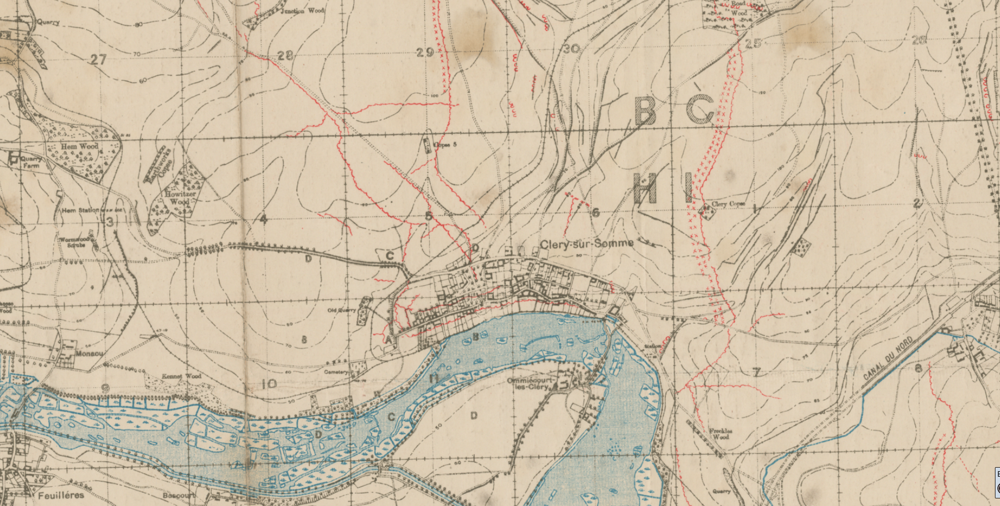
   
  <em>British 1:20,000 trench map, Sheet 62C.NW, 3 September 1916 — the Maricourt–Guillemont sector where Colonel Fairfax fought. Source: National Library of Scotland, CC-BY.</em>

 

# "The Second World War", including a note from Winston Churchill, First Edition, First Printing, Complete Set

### Purchased from the Canadian Federal Government at Auction

Letter is addressed to Colonel Fairfax, a WWI officer Churchill knew through overlapping military service, War Office hierarchy, and Conservative political circles — and whose celebrated actions on the first day of the Battle of the Somme, July 1, 1916, were among the most famous episodes of Anglo-French solidarity in the entire war.

  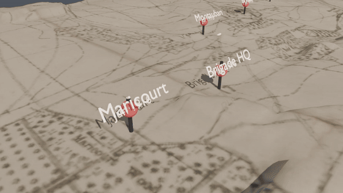
   
  <em>Camera flythrough of the Somme battlefield following Fairfax's documented route — Brigade HQ to Guillemont, July 1916. 1916 trench map on real Copernicus 30m terrain data.</em>

**Interactive Visuals**

[**Provenance Timeline**](https://harleycoops.github.io/Churchill/research/provenance-timeline.html) · [**Artifact Gallery**](https://harleycoops.github.io/Churchill/research/artifact-gallery.html)

## The First Edition

A first edition, first printing of Winston S. Churchill's "The Second World War" (Cassell, UK) is distinguished by several key attributes this set has:

- Published by Cassell and Company Ltd., London, with black cloth boards and gilt spine titles.
- The top edge of the text block is red, though some fading may occur over time.
- Decorative endpapers are present, and the copyright page states only "First Published [year]" without mention of later printings.
- There are no book club, reprint, or export marks, and all folding maps and diagrams are included as called for.
- The dust jackets for Volumes I–IV are priced at "25s. NET," while Volumes V–VI are marked "30s. NET," all printed on uncoated matte paper without later price stickers or publisher imprints.
- Jackets are often prone to browning and wear, that is expected.
- The correct price on the dust jacket is the most visible external sign of a first issue jacket.

**Churchill's Signature Insert**  
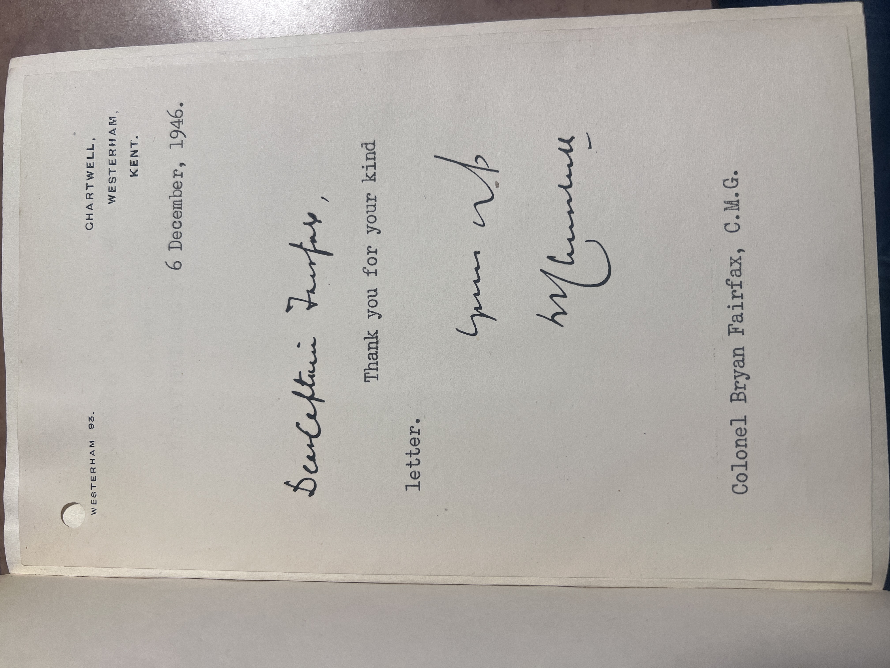  
*The original signed letter from Winston Churchill, dated 6 December 1946, is affixed to Volume I. The letter is addressed to Colonel Fairfax and thanks him for a "kind letter" — written from Chartwell eighteen months before the first volume was published.*

## Who was Colonel Fairfax?

  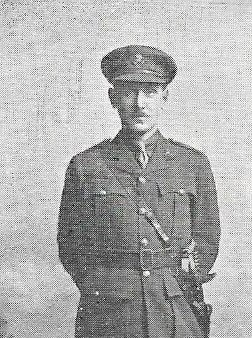

Colonel Bryan Charles Fairfax, C.M.G. (12 September 1873 – 29 January 1950), was a distinguished British Army officer whose career spanned the late Victorian era through the First World War. He initially served as Captain in the 3rd Battalion, King's Own Yorkshire Light Infantry and later in the West India Regiment, and participated in the 1900 Boxer Uprising in China. During World War I, Fairfax commanded the 17th Battalion King's Liverpool Regiment through the bloodiest fighting on the Somme, then the Chinese Labour Corps in France overseeing nearly 100,000 men, and subsequently led Canadian battalions including the 199th Battalion (Duchess of Connaught's Own Irish Canadian Rangers), C.E.F., recruited in Toronto. He was awarded the Companion of the Order of St Michael and St George (C.M.G.) in 1916 for his wartime service.

After the war, Fairfax held significant posts such as Director of Remounts at the War Office and stood as a Conservative candidate in the 1919 Spen Valley by-election. He retired in the 1920s and spent his later years at his estate, Whitwell Hall in Yorkshire, and in Toronto, Canada, where he married Ethel Margaret (Esmé) Gooderham of the prominent Gooderham family. Fairfax died in Toronto in 1950.

The letter, which predates the publication of Churchill's war memoirs, was later affixed inside Volume I of the six-volume Cassell first edition set of "The Second World War" — likely by Fairfax himself or a family member as a keepsake. Fairfax died in Toronto in 1950, so the later volumes would have been assembled after his death.

For a detailed biography and archival references, see his profile at the Imperial War Museum: [Bryan Charles Fairfax – Lives of the First World War](https://livesofthefirstworldwar.iwm.org.uk/lifestory/1187431)

---

## Fairfax at the Somme: What the Primary Sources Tell Us

The following narrative draws exclusively from Brigadier-General F. C. Stanley's *The History of the 89th Brigade 1914–1918* (Liverpool, "Daily Post" Printers, 1919) and the French military citations preserved within it. Stanley commanded the 89th Brigade throughout the Somme; Fairfax served under him as commanding officer of the 17th Battalion King's Liverpool Regiment. Every quotation below is verbatim from these sources, cross-referenced in the [Ground Truth Ledger](research/ground-truth-ledger.md).

[Download the History of the 89th Brigade (PDF)](https://github.com/HarleyCoops/Churchill/blob/main/89thBrigadeStanley.pdf?raw=true)

### Phase 1: The Extreme Right of the British Army (May–June 1916)

By May 1916 the 89th Brigade had moved into the Somme sector, with Brigade Headquarters at **Ailly-sur-Somme** and the 17th Battalion HQ at **Vaux** *(89th Bde, p.119)*. Through June the Brigade advanced to a headquarters position in a **pit southwest of Maricourt** *(p.121)*, placing them at the hinge point where the British and French armies met.

On **28 June 1916**, three days before the great offensive, General Congreve, the Corps Commander, visited the Brigade. Stanley recorded:

> *"I told him that we would do our best, and he said: 'I know you will, and if you cannot manage it, no other troops can.'"*  
> — 89th Bde, p.129; TextExtract.md line 15

That same day, Stanley issued a special order to the entire Brigade:

> *"The 89th Brigade occupies the most honourable position in the whole of the British Army, because not only are we on the extreme right, but we are fighting side by side with the celebrated French Corps de Fer."*  
> — 89th Bde, p.129

### Phase 2: The Attack — 1 July 1916

At **6:25 a.m.** on 1 July 1916, the opening day of the Battle of the Somme, the Brigade launched an intense bombardment. After sixty-five minutes, they went over the parapet *(89th Bde, p.131)*.

In the second wave, **Lieutenant-Colonel Bryan Fairfax** and **Commandant Lepetit** of the French 3rd Battalion, 153e Régiment d'Infanterie advanced **arm in arm across no man's land** — a deliberate act of Allied solidarity at the seam of two armies. This was not an accident of the battlefield; it was planned symbolism under fire.

Both units took their objectives. The **Briqueterie** was captured *(p.131)*. The French 153e RI swept over five lines of enemy trenches. By war's end the regiment would be awarded the Croix de Guerre, the Croix de la Légion d'honneur, and six army-level citations, entitling its soldiers to wear the red fourragère.

Ten days later, **French Colonel de Coutard** wrote an official letter singling Fairfax out by name:

> *"le courage et le sang-froid de nos voisins, officiers et hommes du 17 bataillon de King's Liverpool. En particulier, les relations si cordiales entretenues avec leur chef le Colonel Fairfax ont permis de remarquer ses hautes qualités militaires et ont fait regretter l'éloignement de ce chef brillant et de son magnifique Bataillon."*  
> — 89th Bde, p.134 (11 July 1916)

Translation: *"...the courage and composure of our neighbours, the officers and men of the 17th Battalion King's Liverpool. In particular, the cordial relations maintained with their commander Colonel Fairfax revealed his high military qualities and made all the more regrettable the departure of this brilliant leader and his magnificent Battalion."*

### Phase 3: Trones Wood (Mid-July 1916)

After the success of 1 July, the Brigade was drawn into the brutal fight for **Trones Wood**. Stanley's account places Fairfax in the thick of it:

> *"Brinson... said that Fairfax was in the wood. They had had an awful time, but had not lost many men, were all dug down, and could hold on."*  
> — 89th Bde, p.143

### Phase 4: Guillemont — Gas, Fog, and 1,450 Casualties (29–30 July 1916)

On the **night of 29 July**, while moving to the assembly position for the Guillemont attack, the Germans opened with a new type of gas shell:

> *"The Boche started with a new kind of gas shell, which has a nasty effect first of all, but nothing bad until about eight hours after, when it makes men feel very sick with bad headache and pains in the stomach. Of course all had on their helmets, but a lot of them were very seedy, including Poyntz and Fairfax."*  
> — TextExtract.md line 29

Despite being gassed, Fairfax led the 17th Battalion into battle the next morning. The attack on **30 July** was fought in fog so thick that visibility was ten yards:

> *"of all bad luck in the world it was a thick fog; so thick that you couldn't see more than about ten yards."*  
> — TextExtract.md line 31

Brigade losses that day were catastrophic: **1,450 men** *(TextExtract.md line 47)*.

### Phase 5: "An Absolute Shadow" — Fairfax Forced to Leave

After Guillemont, Stanley wrote the most personal passage in his entire Brigade history about any single officer:

> *"I am sorry to say that at this time we lost the services of Colonel Fairfax. On the way up to the assembly position for the attack on Guillemont he got a dose of gas, and although he stuck it out most gallantly at the time of the attack, it was too much for him afterwards and he suffered very much. He went to an absolute shadow of himself, and although he wanted to stop on with the Battalion, I had to be quite firm and told him that it was out of the question. If he had not gone then I don't think that his life would be worth anything at all. He had been splendid all through this July fighting and had worthily gained the admiration of his Battalion."*  
> — TextExtract.md line 49

The devastation Fairfax left behind speaks to what he had held together. After his departure the 17th Battalion had **no officers of standing except Peck and Draper**, only **10 sergeants and 21 corporals remaining** *(TextExtract.md line 47)*.

Fairfax was evacuated to England at the beginning of August 1916.

  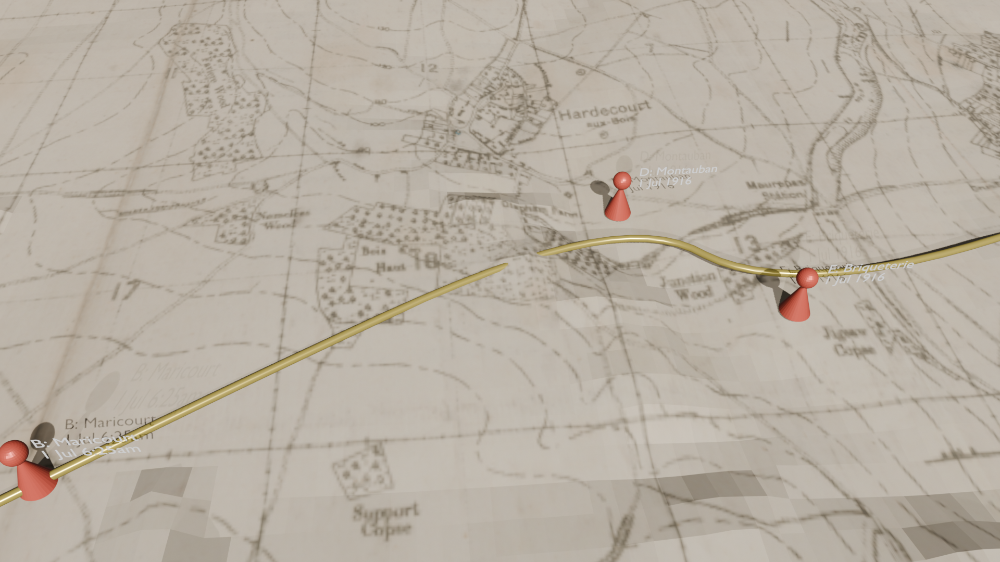
   
  <em>Fairfax's documented route across the Somme battlefield, July 1916. Pins mark each location from the 89th Brigade history: Brigade HQ southwest of Maricourt, through Montauban and Briqueterie (1 July), Trones Wood (mid-July), to the Guillemont assembly position where he was gassed (night of 29 July). 1916 trench map overlaid on Copernicus 30m terrain data.</em>

---

## Why Churchill Knew Fairfax: Five Documented Threads

The Churchill letter of 6 December 1946, addressed to "Dear Colonel Fairfax" and thanking him for a "kind letter," was not a courtesy reply to a stranger. Multiple lines of evidence place these two men in overlapping spheres across three decades.

### 1. Churchill's Own Western Front Service (1915–1916)

Churchill served as Lieutenant-Colonel commanding the 6th Battalion Royal Scots Fusiliers in the Ploegsteert sector from January to May 1916 — returning to London just weeks before the Somme offensive began. As a recent front-line officer and sitting MP, he followed the battle with intense personal interest. Fairfax's arm-in-arm advance on 1 July became one of the most celebrated episodes of the opening day, recounted in Stanley's 1919 published history and in French military citations. Churchill, a voracious reader of military history who had himself just left the trenches, would have encountered this story repeatedly.

### 2. The War Office Connection (1919–1921)

Churchill served as **Secretary of State for War** from January 1919 to February 1921. During this same period, Fairfax held the post of **Director of Remounts at the War Office** *(Readme.md line 38)*. The Director of Remounts reported through the War Office chain of command over which Churchill presided. They were not merely contemporaries — they were in the same building, in the same hierarchy.

### 3. The Chinese Labour Corps

Fairfax **commanded the Chinese Labour Corps in France, overseeing nearly 100,000 men**. Churchill, as Minister of Munitions (1917–1918) and then Secretary of State for War, had direct policy oversight of the labour corps that supported the Western Front. The CLC was a significant and politically sensitive operation; its commander would have been known to the War Secretary.

### 4. Conservative Political Circles

Fairfax **stood as a Conservative candidate in the 1919 Spen Valley by-election**. Churchill was the most prominent Conservative statesman of his generation. The by-election circuit in 1919 was a small world of party networks, constituency associations, and mutual endorsements. Two men of their rank and background — both military officers, both Conservatives — would have crossed paths in this arena.

### 5. The Commonwealth and Canadian Elite

By 1946, Fairfax was a prominent figure in **Toronto**, married into the **Gooderham family** (co-founders of Gooderham & Worts). His son Thomas Bryan McKell Fairfax would become the **14th Lord Fairfax of Cameron**. Churchill maintained extensive ties with Canadian political and military circles throughout his career, and the Fairfax peerage — one of the oldest in the Scottish nobility — carried recognition in its own right. A letter from a decorated Colonel of distinguished lineage, Canadian connections, and shared wartime and political experience would have warranted a personal reply from Chartwell.

---

### Churchill's Whereabouts While Fairfax Led the Charge

All surviving evidence — Churchill's correspondence, appointment diaries, and the parliamentary record — places him in London throughout 1–3 July 1916. He was living with his brother Jack and sister-in-law "Goonie" at 41 Cromwell Road, South Kensington. On Monday 3 July, he took his seat in the House of Commons when Parliament resumed.

| Date           | Best-attested location                                                               | Documentary trail                                                                                                                                                                                                                                                                                                                                      |
| -------------- | ------------------------------------------------------------------------------------ | ------------------------------------------------------------------------------------------------------------------------------------------------------------------------------------------------------------------------------------------------------------------------------------------------------------------------------------------------------ |
| Sat 1 Jul 1916 | 41 Cromwell Road, London SW7 (private residence)                                     | Churchill's "places of residence" list shows he was based at 41 Cromwell Road from Oct/Nov 1915 until the **"autumn of 1916"** ([International Churchill Society][1], [International Churchill Society][2])                                                                                                                                            |
| Sun 2 Jul 1916 | 41 Cromwell Road, London SW7                                                         | No travel entries, letters or diary notes record him leaving London; the Cromwell Road tenancy is continuous over this weekend ([International Churchill Society][1])                                                                                                                                                                                  |
| Mon 3 Jul 1916 | Palace of Westminster (Commons chamber) in the afternoon; otherwise 41 Cromwell Road | The Commons sat on 3 July (Hansard vol. 83). Churchill is **not** listed as a speaker, but MPs' presence is recorded only when they speak; attendance is inferred because his first recorded speech after returning from the front occurs nine days later, on 12 July, and his parliamentary duties had resumed ([Hansard][3], [UK Parliament API][4]) |

[1]: https://winstonchurchill.org/publications/finest-hour/finest-hour-138/churchill-facts-residences-of-winston-and-clementine-churchill/
[2]: https://winstonchurchill.org/resources/speeches/spinning-top-of-memories/?utm_source=chatgpt.com
[3]: https://hansard.parliament.uk/Commons/1916-07-03?utm_source=chatgpt.com
[4]: https://api.parliament.uk/historic-hansard/people/mr-winston-churchill/1916

---

## The Somme Memorial at Maricourt

  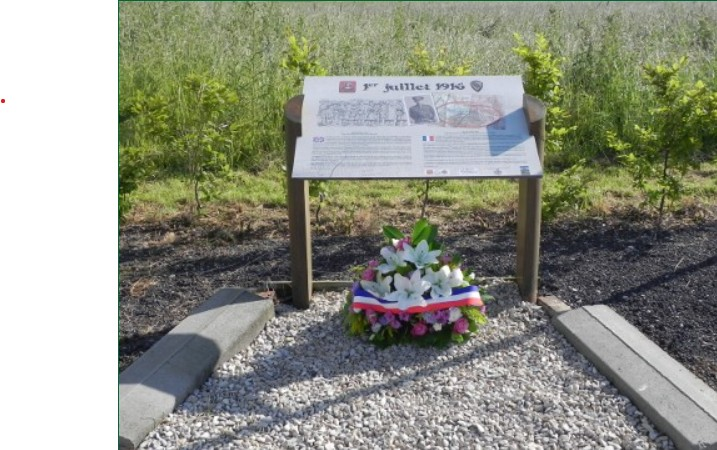  
   
  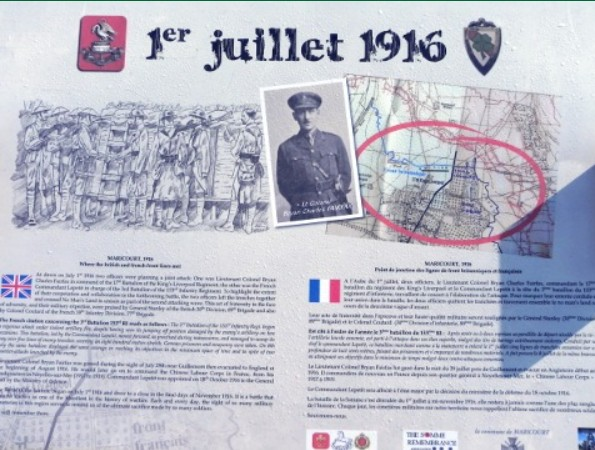  

 

**MARICOURT, 1916** — *Where the British and French front-lines met*

A memorial at Maricourt (coordinates: [49°59'15.0"N 2°47'28.3"E](https://www.google.com/maps/place/49%C2%B059'15.0%22N+2%C2%B047'28.3%22E/@49.9874974,2.7910823,19z/data=!4m4!3m3!8m2!3d49.9874974!4d2.7910823?entry=ttu)) commemorates the joint Anglo-French attack of 1 July 1916 and names Fairfax's advance with his French counterpart. The Battle of Maricourt began on 1 July 1916 and drew to a close in the last days of November 1916. It remains one of the bloodiest engagements in the history of warfare.

### Archival Map Source Images

The images below are fixed crops from the National Library of Scotland trench-map tile sources, not Blender renders. They preserve the map as documentary evidence: place names, trench marks, contour lines, woods, roads, and red overprinted trench positions remain visible without reconstruction styling.

  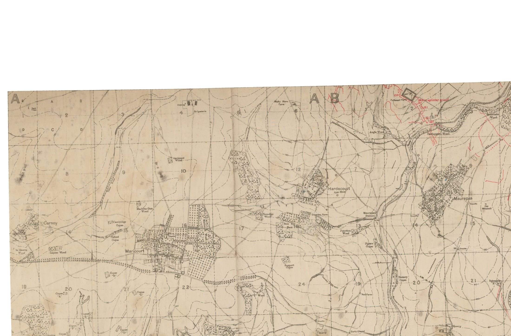
   
  <em>Overview of the Maricourt–Guillemont sector from the NLS trench-map tile set. Source tile set: <code>101465287</code>, z17.</em>

 

  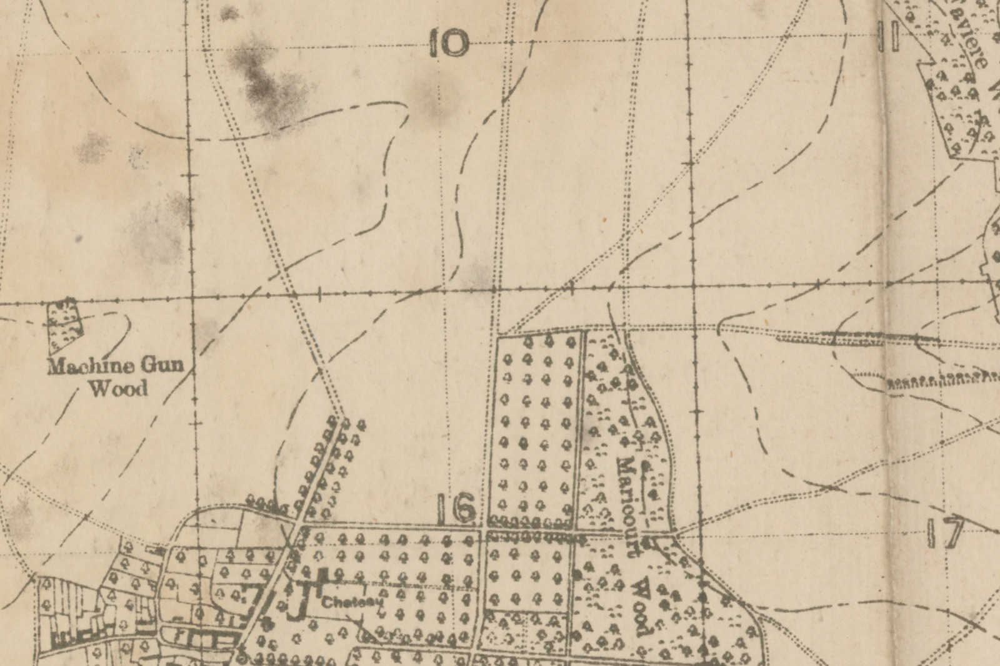
   
  <em>Maricourt sector, where the British and French lines met on 1 July 1916. Source tile set: <code>101465287</code>, z17.</em>

 

  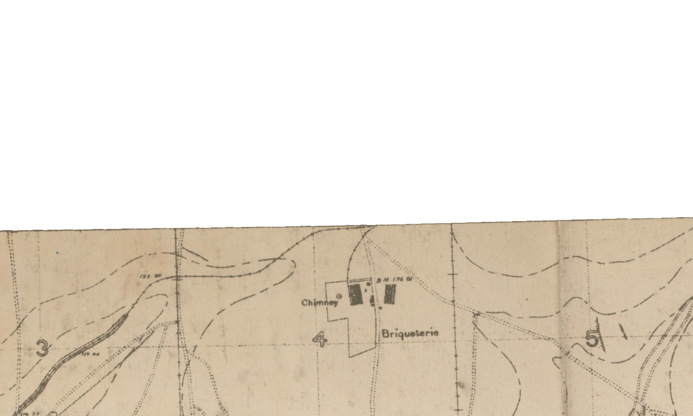
   
  <em>Montauban and the Briqueterie objective on the 1 July axis of advance. Source tile set: <code>101465287</code>, z17.</em>

 

  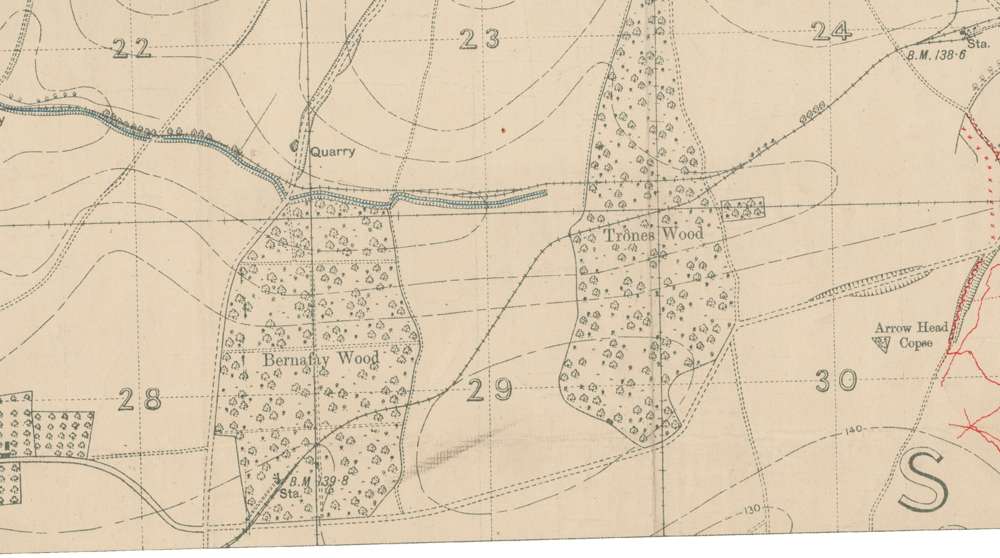
   
  <em>Bernafay Wood and Trones Wood area in the mid-July fighting. Source tile set: <code>101464777</code>, z17.</em>

 

  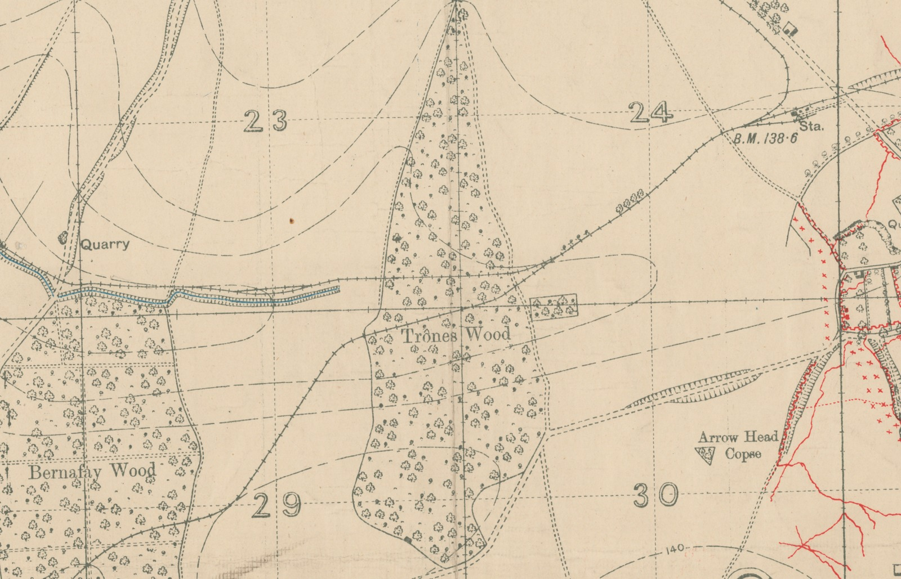
   
  <em>Trones Wood, where Fairfax was reported in the wood with his men dug in and holding. Source tile set: <code>101464777</code>, z17.</em>

 

  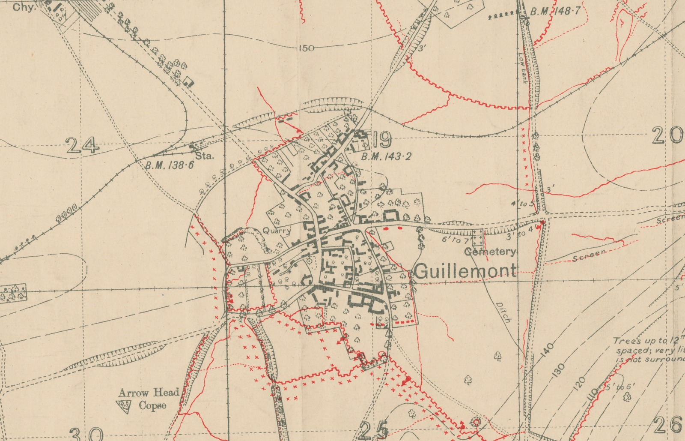
   
  <em>Guillemont approach, the sector of the 29–30 July gas, fog, and assembly-position narrative. Source tile set: <code>101464777</code>, z17.</em>

Source metadata and reproducibility notes are preserved in:

- <code>terrain_data/nls_source_maps/101465287_z17_manifest.json</code>
- <code>terrain_data/nls_source_maps/101464777_z17_northern_crops_manifest.json</code>
- <code>terrain_data/build_nls_source_map_assets.py</code>
- <code>terrain_data/build_nls_northern_source_crops.py</code>

### The French Citation Concerning the 1ˢᵗ Battalion 113ᵗʰ RI

> The 1ˢᵗ Battalion of the 113ᵗʰ Infantry Regiment began its rigorous assault under violent artillery fire, despite having seen its jumping-off positions damaged by the enemy's artillery on two occasions. The battalion, led by Commandant Lapon, moved forward in perfect attack formation and managed to occupy the enemy trenches, securing an eight-hundred-metre stretch. German prisoners and weaponry were taken. On this day the battalion displayed the same courage in reaching its objectives in the minimum space of time and in spite of counter-attacks launched by the enemy.

---

## Chartwell, Westerham, Kent: Churchill's Country Home the Note is From

*Note the location of the return address on the stationary*

Chartwell, located near Westerham in Kent, was the beloved country home of Sir Winston Churchill from 1922 until shortly before his death in 1965. The estate served as both a family retreat and a vital workspace, where Churchill wrote, painted, and entertained guests. The property's panoramic views over the Weald of Kent were a source of inspiration for Churchill, who famously said, "A day away from Chartwell is a day wasted."

  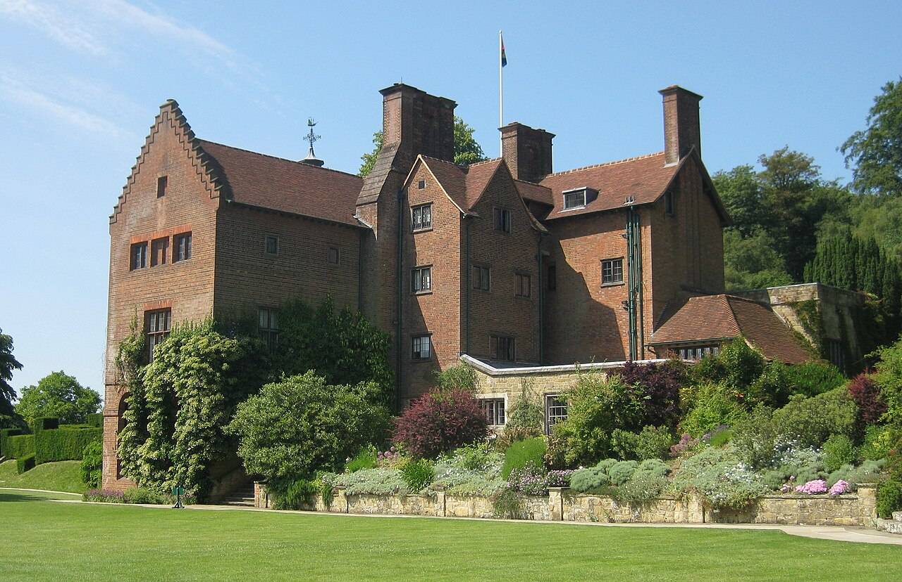  
   
  Rear view of Chartwell House, showing the gardens and the architecture.

 

  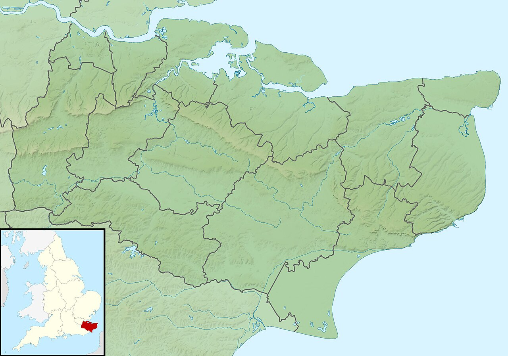  
   
  Relief map indicating the location of Chartwell in Kent, southeast England.

During his years at Chartwell, Churchill used the house's library and study as his primary workspaces. It was here that he drafted much of his correspondence and many of his major works, including his war memoirs. In December 1946, Churchill was deeply engaged in writing and political commentary, having recently delivered the "Iron Curtain" speech and begun work on "The Second World War." He was also extending his landholdings at Chartwell, acquiring additional farmland in 1946–47.

For further reading and exploration:
- [Chartwell on Wikipedia](https://en.wikipedia.org/wiki/Chartwell)
- [Chartwell at the National Trust](https://www.nationaltrust.org.uk/visit/kent/chartwell)
- [Google Maps – Chartwell, Westerham, Kent](https://virtualglobetrotting.com/map/winston-churchills-house/view/google/)

## Provenance

The provenance of this set is notable: it was purchased from the Canadian Federal Government and it was held at a facility in British Columbia, possibly as an unclaimed or escheated property. The lack of aging and creasing of the covers is a testament to its vault-stored location, but no other details are available from the federal government.

## Image Gallery

Below are additional images documenting key features of this set and its authenticity:

- **The Original Churchill Signature Insert — This is fixed to the page**  
  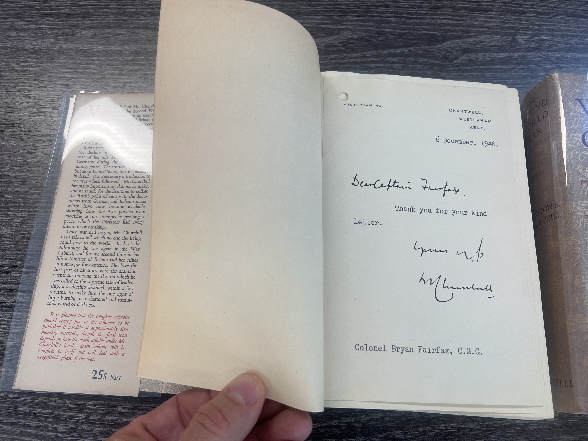  
  The original signed letter from Winston Churchill, dated 6 December 1946, addressed to Colonel Fairfax. This letter is affixed to Volume I and is the centerpiece of the set's provenance and value.

- **First Published Page**  
  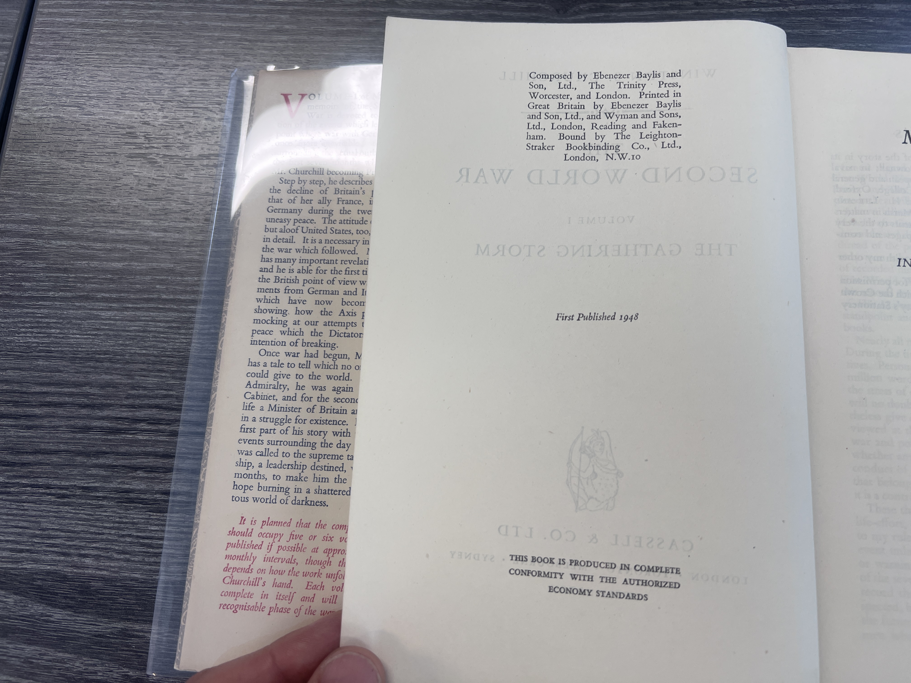  
  This image shows the copyright page, clearly stating "First Published" with the relevant year, confirming the first edition status.

- **Original Dust Jacket Price**  
  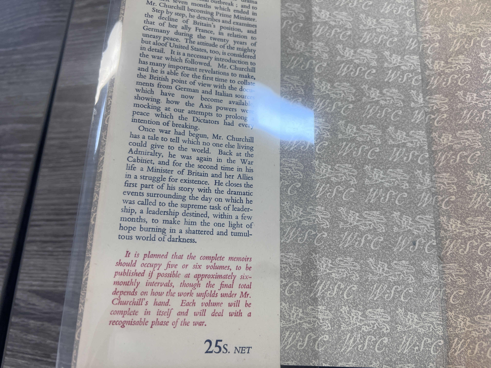  
  The original price printed on the dust jacket, here visible as "25s. NET" or "30s. NET" as appropriate, is a critical indicator of a true first issue jacket.

- **Top Edge of Volume I**  
  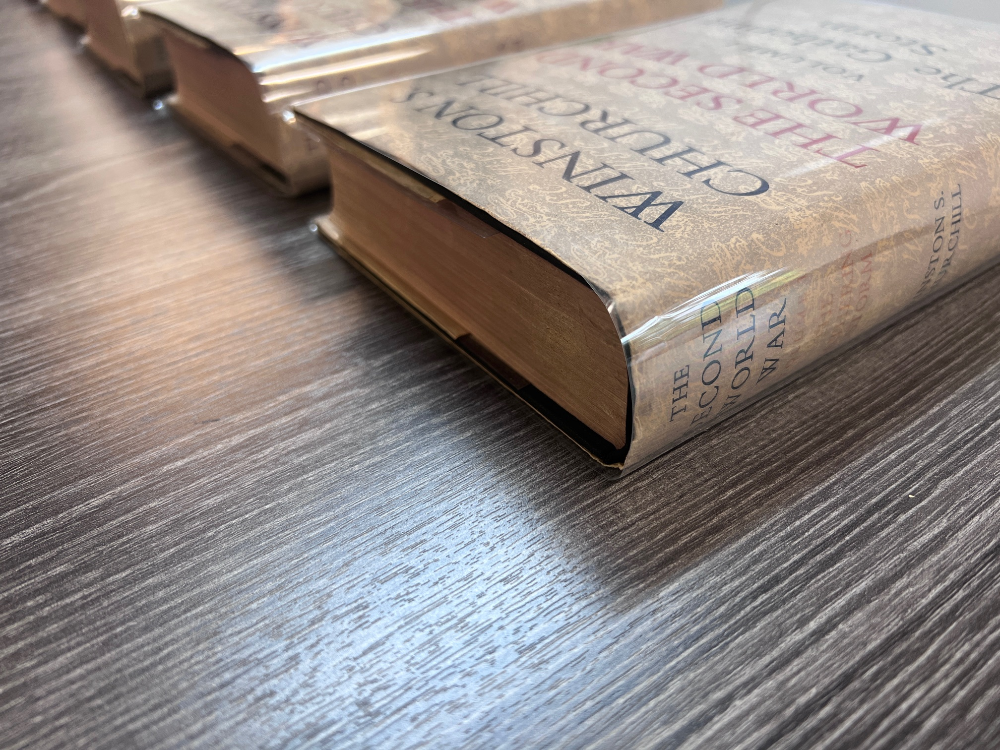  
  The red top edge, a hallmark of the first printing, is shown here. Some fading is typical but the presence of the original red is pronounced and bright on only two of the volumes and quite faded on the rest.

- **This is the worst edge wear I could find**  
  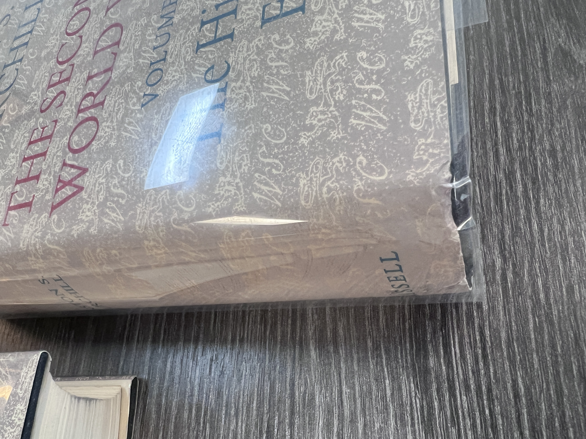  
  No browning on the covers at all.
