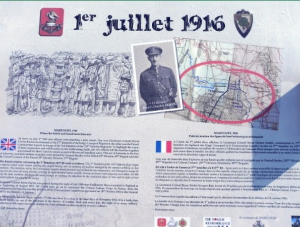

# "The Second World War", including a note from Winston Churchill, First Edition, First Printing, Complete Set

Letter is addressed to Colonel Fairfax, a WWI officer he may have known from historically significant action on the first day of the Battle of the Somme, July 1, 1916. 

## The First Edition

A genuine first edition, first printing of Winston S. Churchill’s "The Second World War" (Cassell, UK) is distinguished by several key attributes this set has:

- Published by Cassell and Company Ltd., London, with black cloth boards and gilt spine titles.
- The top edge of the text block is red, though some fading may occur over time.
- Decorative endpapers are present, and the copyright page states only "First Published [year]" without mention of later printings.
- There are no book club, reprint, or export marks, and all folding maps and diagrams are included as called for.
- The dust jackets for Volumes I–IV are priced at "25s. NET," while Volumes V–VI are marked "30s. NET," all printed on uncoated matte paper without later price stickers or publisher imprints.
- Jackets are often prone to browning and wear, that is expected. 
- The correct price on the dust jacket is the most visible external sign of a first issue jacket.

I have tried to find the original letter that Fairfax sent Churchill the one lead I had was a different Colonel Fairfax. 

**Churchill’s Signature Insert**  
  
*The original signed letter from Winston Churchill, dated 6 December 1946, is affixed to Volume I and is pictured here. The letter is addressed to Colonel Fairfax, a WWI officer he may have known from historically significant action on the first day of the Battle of the Somme, July 1, 1916.*

## Who was Colonel Fairfax?

  

Colonel Bryan Charles Fairfax, C.M.G. (12 September 1873 – 29 January 1950), was a distinguished British Army officer whose career spanned the late Victorian era through the First World War. He initially served as Captain in the 3rd Battalion, King's Own Yorkshire Light Infantry and later in the West India Regiment, and participated in the 1900 Boxer Uprising in China. During World War I, Fairfax commanded the Chinese Labour Corps in France, overseeing nearly 100,000 men, and subsequently led Canadian battalions, including the 199th Battalion (Duchess of Connaught's Own Irish Canadian Rangers), C.E.F., recruited in Toronto. He was awarded the Companion of the Order of St Michael and St George (C.M.G.) in 1916 for his wartime service.

After the war, Fairfax held significant posts such as Director of Remounts at the War Office and stood as a Conservative candidate in the 1919 Spen Valley by-election. He retired in the 1920s and spent his later years at his estate, Whitwell Hall in Yorkshire, and in Toronto, Canada, where he married Ethel Margaret (Esmé) Gooderham of the prominent Gooderham family. Fairfax died in Toronto in 1950.

 The letter, which predates the publication of Churchill’s war memoirs, was later affixed inside Volume I of the six-volume Cassell first edition set of "The Second World War"—likely by Fairfax himself or a family member as a keepsake. Fairfax died in Toronto in 1950, so the later volumes would have been assembled after his death. 

For a detailed biography and archival references, see his profile at the Imperial War Museum: [Bryan Charles Fairfax – Lives of the First World War](https://livesofthefirstworldwar.iwm.org.uk/lifestory/1187431)

## Fairfax's Action at the Battle of the Somme & Memorial

### Background
The 153e Régiment d’Infanterie (RI), part of the French Army’s renowned 39th Division d’Infanterie (the Steel Division), had already seen heavy combat before the Somme offensive, including at Verdun. On July 1, 1916, the opening day of the Battle of the Somme, the French and British army fronts met at this sector. That morning, as the offensive commenced, Lieutenant Colonel Bryan Fairfax, commanding the 17th Battalion King’s Liverpool Regiment, and Commandant Lepetit of the 3rd Battalion 153e RI advanced arm in arm across no man’s land in the second wave—an act symbolizing the friendship and cooperation between the two armies.

Both units succeeded in gaining their objectives. The 153e RI, under intense artillery fire, swept over five lines of enemy trenches, capturing prisoners and weaponry. Their actions earned the regiment a citation, and by war’s end, the 153e RI would be awarded the Croix de Guerre, the Croix de la Légion d’honneur, and six army-level citations, allowing its soldiers to wear the red fourragère of the légion d’honneur. Fairfax’s leadership and the joint advance stand as a testament to Allied courage and solidarity on the Somme’s bloody fields.

### Churchill’s Whereabouts While Fairfax was Leading the Charge

All the surviving evidence—Churchill’s own correspondence, his appointment diaries, and the parliamentary record—places him in London throughout 1–3 July 1916. During this period, he was living with his brother Jack and sister-in-law “Goonie” at 41 Cromwell Road, South Kensington. On Monday 3 July, he took his seat (quietly) in the House of Commons when Parliament resumed after the weekend.

| Date           | Best-attested location                                                               | Documentary trail                                                                                                                                                                                                                                                                                                                                      |
| -------------- | ------------------------------------------------------------------------------------ | ------------------------------------------------------------------------------------------------------------------------------------------------------------------------------------------------------------------------------------------------------------------------------------------------------------------------------------------------------ |
| Sat 1 Jul 1916 | 41 Cromwell Road, London SW7 (private residence)                                     | Churchill’s “places of residence” list shows he was based at 41 Cromwell Road from Oct/Nov 1915 until the **“autumn of 1916”** ([International Churchill Society][1], [International Churchill Society][2])                                                                                                                                            |
| Sun 2 Jul 1916 | 41 Cromwell Road, London SW7                                                         | No travel entries, letters or diary notes record him leaving London; the Cromwell Road tenancy is continuous over this weekend ([International Churchill Society][1])                                                                                                                                                                                  |
| Mon 3 Jul 1916 | Palace of Westminster (Commons chamber) in the afternoon; otherwise 41 Cromwell Road | The Commons sat on 3 July (Hansard vol. 83). Churchill is **not** listed as a speaker, but MPs’ presence is recorded only when they speak; attendance is inferred because his first recorded speech after returning from the front occurs nine days later, on 12 July, and his parliamentary duties had resumed ([Hansard][3], [UK Parliament API][4]) |

- [Churchill Facts: Residences of Winston and Clementine Churchill - International Churchill Society][1]
- [Spinning Top of Memories - International Churchill Society][2]
- [House of Commons - Hansard - UK Parliament][3]
- [Mr Winston Churchill: speeches in 1916 (Hansard)][4]

[1]: https://winstonchurchill.org/publications/finest-hour/finest-hour-138/churchill-facts-residences-of-winston-and-clementine-churchill/
[2]: https://winstonchurchill.org/resources/speeches/spinning-top-of-memories/?utm_source=chatgpt.com
[3]: https://hansard.parliament.uk/Commons/1916-07-03?utm_source=chatgpt.com
[4]: https://api.parliament.uk/historic-hansard/people/mr-winston-churchill/1916

## Location of the Somme Memorial Featuring Fairfax

    
   
    

 

**MARICOURT, 1916**  
*Where the British and French front-lines met*

At dawn on **1 July 1916** two officers were planning a joint attack.  
One was **Lieutenant-Colonel Bryan Charles Fairfax**, in command of the **1st Battalion of The King’s Liverpool Regiment**;  
the other was the French **Commandant Lapon**, in charge of the **1st Battalion of the 113ᵗʰ Infantry Regiment**.  
To highlight the extent of their cooperation in the forthcoming battle, the two officers left the trench together and crossed **No-Man’s-Land** in unison as part of the first attacking wave.  
This act of bravery in the face of adversity, and their military expertise, were praised by **General Stanley** of the French **39ᵗʰ Division, 117ᵗʰ Brigade** and also by **Colonel Cochard** of the French **39ᵗʰ Infantry Division, 77ᵗʰ Brigade**.

---

### The French citation concerning the 1ˢᵗ Battalion 113ᵗʰ RI reads as follows

The 1ˢᵗ Battalion of the 113ᵗʰ Infantry Regiment began its rigorous assault under violent artillery fire, despite having seen its jumping-off positions damaged by the enemy’s artillery on two occasions.  
The battalion, led by Commandant Lapon, moved forward in perfect attack formation and managed to occupy the enemy trenches, securing an eight-hundred-metre stretch.  
German prisoners and weaponry were taken.  
On this day the battalion displayed the same courage in reaching its objectives in the minimum space of time and in spite of [illegible] counter-attacks launched by the enemy.

---

**Lieutenant-Colonel Bryan Fairfax** was wounded during the night of **1–2 July** near **Guillemont** then evacuated to England at the beginning of **August 1916**.  
His wound later got him an appointment with the **Chinese Labour Corps** in France.  
After his demobilisation he joined **MI6** on **18 October 1916** in the General Staff at the [illegible] Ministry of Defence.

---

The **Battle of Maricourt** began on **1 July 1916** and drew to a close in the last days of **November 1916**.  
It is a battle that still ranks as one of the bloodiest in the history of warfare.  

**[Click here to view the memorial’s location on Google Maps.](https://www.google.com/maps/place/49%C2%B059'15.0%22N+2%C2%B047'28.3%22E/@49.9874974,2.7910823,19z/data=!4m4!3m3!8m2!3d49.9874974!4d2.7910823?entry=ttu)**

Incredibly, there is a contemporary account from 1919 about the actions of Colonel Fairfax on the day and you can download the full book from here: 

[Download the History of the 89th Brigade (PDF)](https://github.com/HarleyCoops/Churchill/blob/main/89thBrigadeStanley.pdf?raw=true)

## Chartwell, Westerham, Kent: Churchill’s Country Home the Note is From

*Note the location of the return address on the stationary*

Chartwell, located near Westerham in Kent, was the beloved country home of Sir Winston Churchill from 1922 until shortly before his death in 1965. The estate served as both a family retreat and a vital workspace, where Churchill wrote, painted, and entertained guests. The property’s panoramic views over the Weald of Kent were a source of inspiration for Churchill, who famously said, “A day away from Chartwell is a day wasted.”

    
   
  Rear view of Chartwell House, showing the gardens and the architecture that inspired Churchill’s creative and political work.

 

    
   
  Relief map indicating the location of Chartwell in Kent, southeast England.

During his years at Chartwell, Churchill used the house’s library and study as his primary workspaces. It was here that he drafted much of his correspondence and many of his major works, including his war memoirs. The library, in particular, was the intellectual heart of Chartwell, lined with books and personal papers, while the bedrooms offered privacy for personal reflection and letter writing. Although the precise room where Churchill signed the letter to Colonel Fairfax on 6 December 1946 is not documented, it is highly likely it was written in either his study or the library, both of which remain preserved today.

In December 1946, Churchill was deeply engaged in writing and political commentary, having recently delivered the “Iron Curtain” speech and begun work on "The Second World War." He was also extending his landholdings at Chartwell, acquiring additional farmland in 1946–47. No major public event is recorded at Chartwell on 6 December 1946, but Churchill’s routine at the time would have included extensive correspondence and literary work at his country home.

For further reading and exploration:
- [Chartwell on Wikipedia](https://en.wikipedia.org/wiki/Chartwell)
- [Chartwell at the National Trust](https://www.nationaltrust.org.uk/visit/kent/chartwell)
- [Google Maps – Chartwell, Westerham, Kent](https://virtualglobetrotting.com/map/winston-churchills-house/view/google/)

Visitors today can tour the house and grounds, including the library and study where Churchill’s historic correspondence was likely composed.

## Provenance

The provenance of this set is notable: it was purchased from the Canadian Federal Government and it was held at afacility in British Columbia, possibly as an unclaimed or escheated property. The lack of aging and creasing of the covers is a testament to its' vault stored location but no other details are available from the federal government.

## Image Gallery

Below are additional images documenting key features of this set and its authenticity:

- **First Published Page**  
    
  This image shows the copyright page, clearly stating "First Published" with the relevant year, confirming the first edition status.

- **Original Dust Jacket Price**  
    
  The original price printed on the dust jacket, here visible as "25s. NET" or "30s. NET" as appropriate, is a critical indicator of a true first issue jacket.

- **Top Edge of Volume I**  
    
  The red top edge, a hallmark of the first printing, is shown here. Some fading is typical but the presence of the original red is pronounced and bright on only two of the volumes and quite faded on the rest.

- **This is the worst edge wear I could find**  
    
  This photo documents the absence of aging or browning on the covers. 

